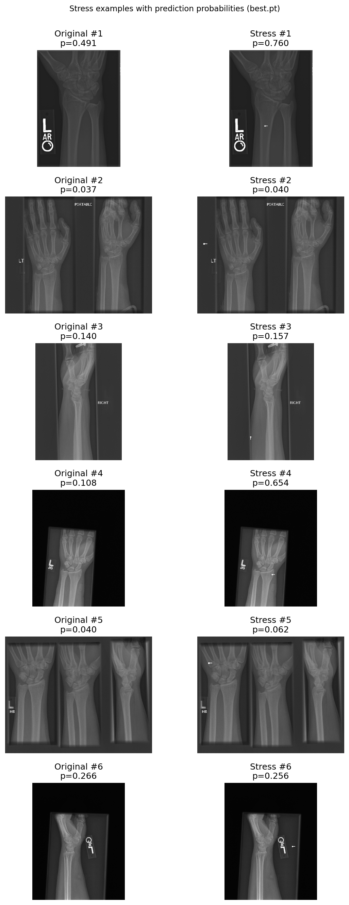
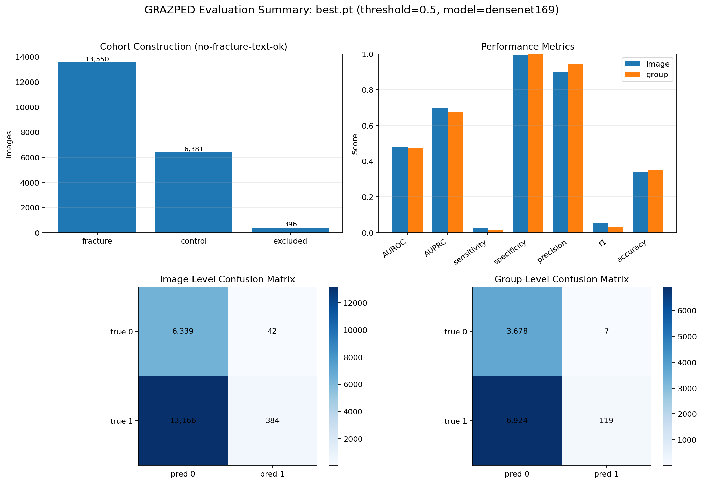

# DeepDx

This repository bundles code and outputs for reproducing a **musculoskeletal abnormality detection** pipeline on the [MURA](https://arxiv.org/abs/1712.06957) benchmark: a **DenseNet-169**–based classifier for wrist and shoulder radiographs, followed by **stress tests** (artificial hardware-like noise on normal images) and **out-of-domain evaluation** on a pediatric wrist dataset (GRAZPED).

This project was developed as part of a group final project for CSCI1470 - Deep Learning.

## Guiding Paper

The approach and evaluation framing follow the MURA paper:

> **MURA: Large Dataset for Abnormality Detection in Musculoskeletal Radiographs**  
> Pranav Rajpurkar et al., arXiv:1712.06957.

## Repository Components

| Path | Role |
|------|------|
| [`pytorch_model.py`](pytorch_model.py) | PyTorch implementation of the **DenseNet-169** classifier used for MURA-style binary abnormality prediction. |
| [`model_stress_test.py`](model_stress_test.py) | **Stress test**: overlays synthetic “hardware” artifacts (e.g., bright screw-like marks) on otherwise normal wrist radiographs and compares model probabilities before and after perturbation. |
| [`graz_ped.py`](graz_ped.py) | Evaluates the trained model on a **pediatric** wrist cohort derived from **GRAZPED**, distinct from MURA’s adult-centric distribution. |
| [`visualize_graz_results.py`](visualize_graz_results.py) | Builds summary figures and tables from the GRAZPED run (metrics, confusion matrices, cohort counts). |
| [`stress_test_visualizations/`](stress_test_visualizations/) | Saved stress-test figures (e.g., original vs. perturbed grids and probability shifts). |
| [`graz_ped_outputs/`](graz_ped_outputs/) | Saved GRAZPED evaluation artifacts (plots, CSVs, JSON summaries). |
| [`assets/DeepDx Presentation Poster.jpg`](assets/DeepDx%20Presentation%20Poster.jpg) | Project poster with **primary MURA wrist/shoulder** training and validation metrics. |

---

## Results on MURA-style wrist and shoulder training

The poster below summarizes **end-to-end replication** on the literature setup: DenseNet-169 with study-level aggregation, weighted binary cross-entropy, and reported **AUROC**, sensitivity, specificity, and related metrics for **overall**, **wrist**, and **shoulder**—showing that the published pipeline can be brought up to comparable performance.

---

## Stress test: synthetic hardware noise

To probe robustness and sensitivity to **high-contrast artifacts** similar to surgical hardware, [`model_stress_test.py`](model_stress_test.py) augments normal images with small bright “screw” overlays and compares predicted abnormality probabilities. In the accompanying grid, the model **maintains strong performance** for non-interfering hardware (i.e additions that are not randomly placed over the bone), demonstrating that it does not **uniformly** treat hardware-like noise as evidence of abnormality.

The grid below (**original vs. stress**, with per-image probability `p`) shows that the model **largely preserves its predictions** under this perturbation: in most shown pairs the probability moves only slightly, indicating **robustness to incidental hardware-like noise** when the artifact falls in **soft tissue or background**. Where the same overlay sits **directly on cortical bone**, the score can increase sharply—highlighting **localized sensitivity** to high-contrast structure that clinicians should keep in mind.

---

## Generalization: pediatric wrist evaluation (GRAZPED)

[`graz_ped.py`](graz_ped.py) and [`visualize_graz_results.py`](visualize_graz_results.py) evaluate the **same MURA-trained checkpoint** on GRAZPED-derived pediatric wrist images. The summary figure quantifies **image-level and group-level** behavior: the run highlights how a model tuned on MURA can exhibit **strong specificity and precision** yet **very low sensitivity** at a fixed 0.5 threshold on this cohort, (i.e., a **conservative** bias with many false negatives), underscoring that **adult MURA statistics do not automatically transfer** to pediatric data without recalibration or retraining.

